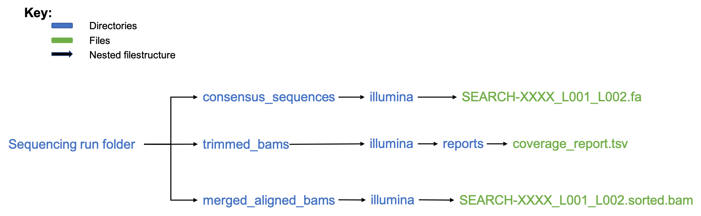

# 
This is the code repository for `bjorn` - a suite of miscellaneous tools that can be used to:

* generate information for large-scale genomic surveillance of SARS-CoV-2 sequences. This functionality relies on external tools such as `datafunk`, `minimap2`, and `pandas`. 

* prepare results and data files from SARS-CoV-2 sequencing analysis for release to public databases such as GISAID, Google Cloud, and GitHub

## Installation
* Install Anaconda: [instructions can be found here](https://docs.anaconda.com/anaconda/install/)
* Create the `bjorn` environment
```bash
conda env create -f env/linux.yml -n bjorn
```
* Activate environment
```bash
conda activate bjorn
```
* Install datafunk (inside the activated environment): [instructions (ensure environment is activated during installation)](https://github.com/cov-ert/datafunk)

## Usage
### Information for Surveillance of SARS-CoV-2 Genomic Mutations
* Activate `bjorn` environment
```bash
conda activate bjorn
```
* Copy and modify `test_config.json` to specify your parameters such as
    * gisaid sign-in info 
    * output directory where results are saved
    * number of CPU cores available for use by minimap2
    * current date (false for latest; fix for testing)    
* Run the `run_pipeline.sh` script to initiate the Snakemake pipeline
```bash
bash run_pipeline.sh [CONFIG_FILE]
```

### Post-processing of SARS-CoV-2 Sequencing Results for Release to public databases
* Activate `bjorn` environment
```bash
conda activate bjorn
```
* Open `run_alab_release.sh` to specify your parameters such as
    * filepath to sample sheet containing sample metadata (input)
    * filepath to updated metadata of samples that have already been uploaded
    * output directory where results are saved
    * number of CPU cores available for use
    * minimum coverage required for each sample (QC filter)
    * minimum average depth required for each sample (QC filter)
    * DEFAULT: test parameters
* Open `config.json` to specify your parameters such as
    * list of SARS-CoV-2 genes that are considered non-concerning
        * i.e. the occurrence of open-read frame (ORF) altering mutations can be accepted
        * e.g. ['ORF8', 'ORF10']
    * list of SARS-CoV-2 mutations that are considered non-concerning
        * i.e. the occurrence of `ORF8:Q27_` can be accepted (B117 exists)
        * e.g. ['ORF8:Q27_']
* Run the `run_alab_release.sh` script to initiate the data release pipeline
```bash
bash run_alab_release.sh
```
* `bjorn` assumes the following file structure for the input sequencing data

