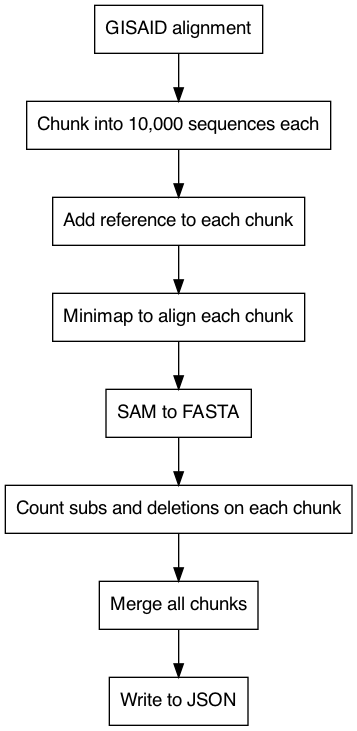

# Bjorn1.5: A pipeline for multi-threaded extraction of mutation information from SARS-CoV-2 sequences

The pipeline is heavily reliant on the following tools:
* biopython
* pandas
* numpy
* snakemake
* minimap2
* datafunk
* more-itertools
* json

